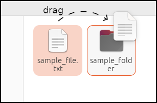
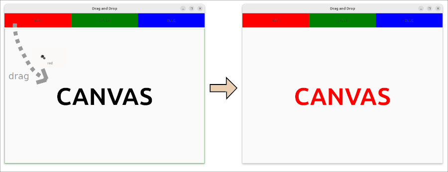

# Drag and drop

## What's drag and drop?

Drag and drop is also written as "Drag-and-Drop", or "DND" in short.
DND is like "copy and paste" or "cut and paste".
If a user drags a UI element, which is a widget, selected part or something, data is transferred from the source to the destination.

You probably have experience that you moved a file with DND.

{width=4.6cm height=3cm}

When the DND starts, the file `sample_file.txt` is given to the system.
When the DND ends,  the system gives `sample_file.txt` to the directory `sample_folder` in the file manager.
Therefore, it is like "cut and paste".
The actual behavior may be different from the explanation here, but the concept is similar.

## Example for DND

This tutorial provides a simple example in the `src/dnd` directory.
It has three labels for the source and one label for the destination.
The source labels have "red", "green" or "blue" labels.
If a user drags the label to the destination label, the font color will be changed.

{width=13.5cm height=5.2cm}

## UI file

The widgets are defined in the XML file `dnd.ui`.

@@@include
dnd/dnd.ui
@@@

It is converted to a resource file by `glib-compile-resources`.
The compiler uses an XML file `dnd.gresource.xml`.

@@@include
dnd/dnd.gresource.xml
@@@

## C file dnd.c

The C file `dnd.c` isn't a big file.
The number of the lines is less than a hundred.
A GtkApplication object is created in the function `main`.

@@@include
dnd/dnd.c main
@@@

The application ID is defined as:

@@@if gfm
```C
#define APPLICATION_ID "com.github.ToshioCP.dnd"
```
@@@else
```{.C}
#define APPLICATION_ID "com.github.ToshioCP.dnd"
```
@@@end

### Startup signal handler

Most of the work is done in the "startup" signal handler.

Two objects GtkDragSource and GtkDropTarget is used for DND implementation.

- Drag source: A drag source (GtkDragSource instance) is an event controller.
It initiates a DND operation when the user clicks and drags the widget.
If a data, in the form of GdkContentProvider, is set in advance, it gives the data to the system at the beginning of the drag.
- Drop target: A drop target (GtkDropTarget) is also an event controller.
You can get the data in the GtkDropTarget::drop signal handler.

The example below uses these objects in a very simple way.
You can use number of features that the two objects have.
See the following links for more information.

- [Drag-and-Drop in GTK](https://docs.gtk.org/gtk4/drag-and-drop.html)
- [GtkDragSource](https://docs.gtk.org/gtk4/class.DragSource.html)
- [GtkDropTarget](https://docs.gtk.org/gtk4/class.DropTarget.html)

@@@include
dnd/dnd.c app_startup
@@@

- 15-22: Builds the widgets.
The array `source_labels[]` points the source labels red, green and blue in the ui file.
The variable `canvas` points the destination label.
- 24-30: Sets the DND source widgets.
The for-loop carries out through the array `src_labels[]` each of which points the source widget,  red, green or blue label.
- 25: Creates a new GtkDragSource instance.
- 26: Creates a new GdkContentProvider instance with the string "red", "green" or "blue.
They are the name of the widgets.
These strings are the data to transfer through the DND operation.
- 27: Sets the content of the drag source to the GdkContentProvider instance above.
- 28: Content is useless so it is destroyed.
- 29: Add the event controller, which is actually the drag source, to the widget.
If a DND operation starts on the widget, the corresponding drag source works and the data is given to the system.
- 32-34: Sets the DND drop target.
- 32: Creates a new GtkDropTarget instance.
The first parameter is the GType of the data.
The second parameter is a GdkDragAction enumerate constant.
The arguments here are string type and the constant for copy.
- 33: Connects the "drop" signal and the handler `drop_cb`.
- 34: Add the event controller, which is actually the drop target, to the widget.
- 36-43: Sets CSS.
- 37: A varable `format` is static and defined at the top of the program.
Static variables are shown below.

@@@if gfm
```C
static GtkCssProvider *provider = NULL;
static const char *format = "label {padding: 20px;} label#red {background: red;} "
  "label#green {background: green;} label#blue {background: blue;} "
  "label#canvas {color: %s; font-weight: bold; font-size: 72pt;}";
```
@@@else
```{.C}
static GtkCssProvider *provider = NULL;
static const char *format = "label {padding: 20px;} label#red {background: red;} "
  "label#green {background: green;} label#blue {background: blue;} "
  "label#canvas {color: %s; font-weight: bold; font-size: 72pt;}";
```
@@@end

### Activate signal handler

@@@include
dnd/dnd.c app_activate
@@@

This handler just shows the window.

### Drop signal handler

@@@include
dnd/dnd.c drop_cb
@@@

The "drop" signal handler has five parameters.

- GtkDropTarget instance on which the signal has been emitted.
- GValue that holds the data from the source.
- The arguments `x` and `y` are the coordinate of the mouse when released.
- User data was set when the signal and handler was connected.

The string from the GValue is "red", "green" or "blue".
It replaces "%s" in the variable `format`.
That means the font color of the label `canvas` will turn to the color.

## Meson.build

The file `meson.build` controls the building process.

@@@include
dnd/meson.build
@@@

You can build it from the command line.

```
$ cd src/dnd
$ meson setup _build
$ ninja -C _build
$ _build/dnd
```

The source files are under the directory `src/dnd` of the [repository](https://github.com/ToshioCP/Gtk4-tutorial).
Download it and see the directory.
